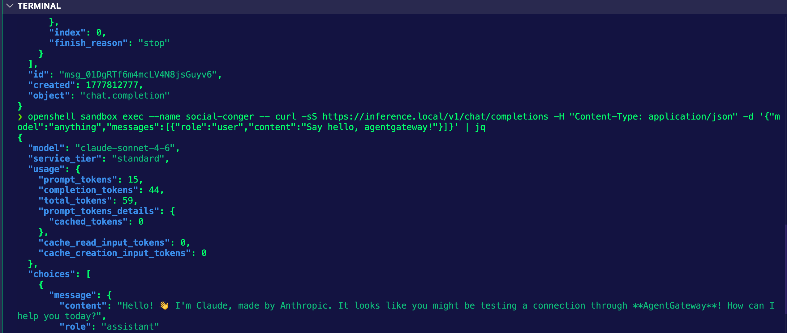

# OpenShell with agentgateway

Use this setup when OpenShell should manage the sandbox runtime, while agentgateway handles model traffic.

OpenShell gateway and agentgateway are different components:

- OpenShell gateway is the sandbox control plane. It creates sandboxes, stores providers, applies policies, and exposes `inference.local` inside sandboxes.
- Agentgateway is the upstream LLM/MCP gateway. OpenShell can route `inference.local` traffic to agentgateway when agentgateway exposes an OpenAI-compatible `/v1` API.

TLDR; agentgateway does the upstream inference routing.

Configure OpenShell inference routing to send sandbox model calls to agentgateway.

## Prerequisites

- Docker Desktop or another Docker-compatible runtime is running for OpenShell.
- Agentgateway is deployed in Kubernetes.
- Any provider credentials required by agentgateway are already configured on the agentgateway side, or agentgateway accepts the placeholder key shown below.

On macOS with Docker Desktop, OpenShell may need Docker socket explicitly set:

```bash
export DOCKER_HOST=unix:///$HOME/.docker/run/docker.sock
```

## Gateway Setup

```
export ANTHROPIC_API_KEY=
```

```
kubectl apply -f- <<EOF
apiVersion: v1
kind: Secret
metadata:
  name: anthropic-secret
  namespace: agentgateway-system
type: Opaque
stringData:
  Authorization: $ANTHROPIC_API_KEY
EOF
```

```
kubectl apply -f - <<EOF
apiVersion: gateway.networking.k8s.io/v1
kind: Gateway
metadata:
  name: agentgateway-openshell
  namespace: agentgateway-system
spec:
  gatewayClassName: agentgateway
  listeners:
    - name: http
      port: 8080
      protocol: HTTP
      allowedRoutes:
        namespaces:
          from: Same
EOF
```

```
kubectl apply -f - <<EOF
apiVersion: agentgateway.dev/v1alpha1
kind: AgentgatewayBackend
metadata:
  name: anthropic
  namespace: agentgateway-system
spec:
  ai:
    provider:
        anthropic:
          model: "claude-sonnet-4-6"
  policies:
    auth:
      secretRef:
        name: anthropic-secret
EOF
```

```
kubectl apply -f - <<EOF
apiVersion: gateway.networking.k8s.io/v1
kind: HTTPRoute
metadata:
  name: openshell-openai
  namespace: agentgateway-system
spec:
  parentRefs:
    - name: agentgateway-openshell
      namespace: agentgateway-system
  rules:
  - matches:
    - path:
        type: PathPrefix
        value: /v1
    backendRefs:
    - name: anthropic
      namespace: agentgateway-system
      group: agentgateway.dev
      kind: AgentgatewayBackend
EOF
```

```
export GATEWAY_ADDRESS=$(kubectl get svc -n agentgateway-system agentgateway-openshell -o jsonpath="{.status.loadBalancer.ingress[0]['hostname','ip']}")
echo $GATEWAY_ADDRESS
```

```
curl "http://$GATEWAY_ADDRESS:8080/v1/chat/completions" -H content-type:application/json -d '{
  "model": "claude-sonnet-4-6",
  "messages": [
    {
      "role": "system",
      "content": "You are a skilled cloud-native network engineer."
    },
    {
      "role": "user",
      "content": "Write me a paragraph containing the best way to think about Istio Ambient Mesh"
    }
  ]
}' | jq
```

## Start OpenShell gateway

OpenShell can bootstrap its local gateway automatically when creating a sandbox, but starting it explicitly makes setup easier to verify.

```bash
openshell gateway start
openshell status
```

If Docker Desktop on macOS is running but OpenShell cannot find Docker, run commands with `DOCKER_HOST` set:

```bash
DOCKER_HOST=unix:///$HOME/.docker/run/docker.sock openshell gateway start
DOCKER_HOST=unix:///$HOME/.docker/run/docker.sock openshell status
```

## Get Agentgateway address

Receive the agentgateway address from the Kubernetes `LoadBalancer` service:

```bash
export GATEWAY_ADDRESS=$(kubectl get svc -n agentgateway-system agentgateway-openshell -o jsonpath="{.status.loadBalancer.ingress[0]['hostname','ip']}")
echo $GATEWAY_ADDRESS
```

If the output is empty, the service does not have an external address yet. Check service status:

```bash
kubectl get svc agentgateway-openshell -n agentgateway-system
```

## Verify Agentgateway OpenAI-compatible endpoint

OpenShell should point at Agentgateways OpenAI-compatible base URL:

```bash
export AGENTGATEWAY_OPENAI_BASE_URL=http://$GATEWAY_ADDRESS:8080/v1
echo $AGENTGATEWAY_OPENAI_BASE_URL
```

Quick check:

```bash
curl -sS "$AGENTGATEWAY_OPENAI_BASE_URL/chat/completions" \
  -H "Content-Type: application/json" \
  -d '{
    "model": "claude-sonnet-4-6",
    "messages": [
      {
        "role": "user",
        "content": "Say hello through agentgateway."
      }
    ]
  }' | jq
```

Expected result depends on agentgateway configuration. A successful chat completion confirms the route is reachable. An auth or upstream error can still be useful if it proves traffic reached agentgateway.

## Create OpenShell provider for agentgateway

Create an OpenShell provider of type `openai` that points at agentgateway.

```bash
openshell provider create \
  --name agentgateway-openshell \
  --type openai \
  --credential OPENAI_API_KEY=unused \
  --config OPENAI_BASE_URL=$AGENTGATEWAY_OPENAI_BASE_URL
```

Use a real key instead of `unused` only if agentgateway expects OpenShell to forward a client credential. In the preferred setup, agentgateway owns upstream provider credentials and OpenShell stores only a placeholder key.

Verify provider registration:

```bash
openshell provider list
openshell provider get agentgateway-openshell
```

Output:
```
❯ openshell provider list
NAME                    TYPE    CREDENTIAL_KEYS   CONFIG_KEYS
agentgateway-openshell  openai  1                 1

❯ openshell provider get agentgateway-openshell
Provider:

Id: c701b8d0-e7fc-461e-b55f-3a0b65f31d1a
Name: agentgateway-openshell
Type: openai
Credential keys: OPENAI_API_KEY
Config keys: OPENAI_BASE_URL
```

## Route `inference.local` to agentgateway

Set the active OpenShell gateway's managed inference route to the agentgateway provider. You can use the same Model ID thats set up in your agentgateway backend. Even though its already set in `AgentgatewayBackend`, its still required by OpenShell.

```bash
openshell inference set \
  --provider agentgateway-openshell \
  --model claude-sonnet-4-6 \
  --timeout 300
```

Output:

```bash
Gateway inference configured:

Route: inference.local
Provider: agentgateway-openshell
Model: claude-sonnet-4-6
Version: 1
Timeout: 300s
Validated Endpoints:
- http://20.57.192.210:8080/v1/chat/completions (openai_chat_completions)
```

Verify:

```bash
openshell inference get
```

## Create sandbox

Create a sandbox normally. OpenShell will expose `https://inference.local` inside the sandbox and route supported inference calls through agentgateway.

```bash
openshell sandbox create -- claude
```

You'll get a request to set your Anthropic API Key, but you can just choose the default or choose none as its already set in agentgateway.

## Verify from inside sandbox

```bash
openshell sandbox list
```

Copy the sandbox name, then run an `exec`.

For example, if your sandbox name is `social-conger`, use the following:

```bash
openshell sandbox exec --name social-conger -- curl -sS https://inference.local/v1/chat/completions -H "Content-Type: application/json" -d '{"model":"anything","messages":[{"role":"user","content":"Say hello, agentgateway!"}]}' | jq
```

You should see an output similar to the below:



You can check that the traffic went through the gateway by looking at the logs:
```
kubectl logs agentgateway-openshell-xxxx -n agentgateway-system
```

Output example:
```
2026-05-03T12:53:30.56091Z      info    request gateway=agentgateway-system/agentgateway-openshell listener=http route=agentgateway-system/openshell-openai endpoint=api.anthropic.com:443 src.addr=10.224.0.33:26111 http.method=POST http.host=20.57.192.210 http.path=/v1/chat/completions http.version=HTTP/1.1 http.status=200 protocol=llm gen_ai.operation.name=chat gen_ai.provider.name=anthropic gen_ai.request.model=claude-sonnet-4-6 gen_ai.response.model=claude-sonnet-4-6 gen_ai.usage.input_tokens=15 gen_ai.usage.cache_read.input_tokens=0 gen_ai.usage.output_tokens=44 duration=1975ms
```