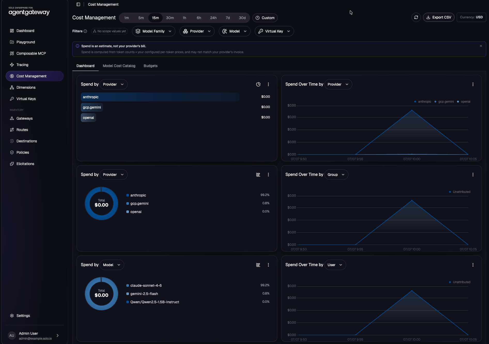
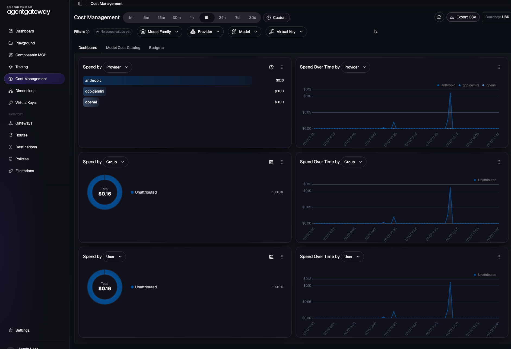
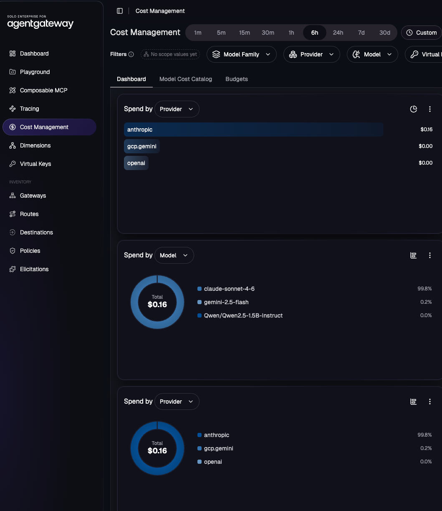
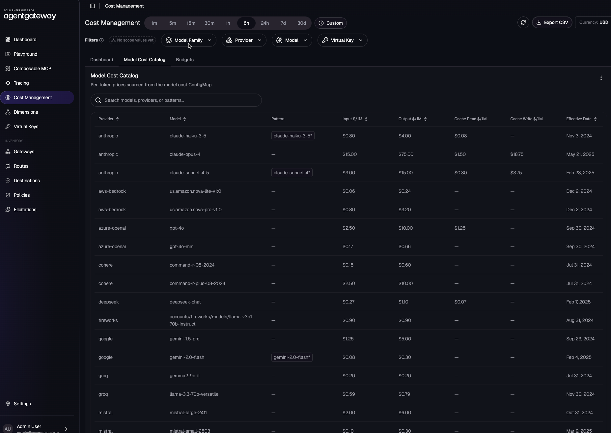
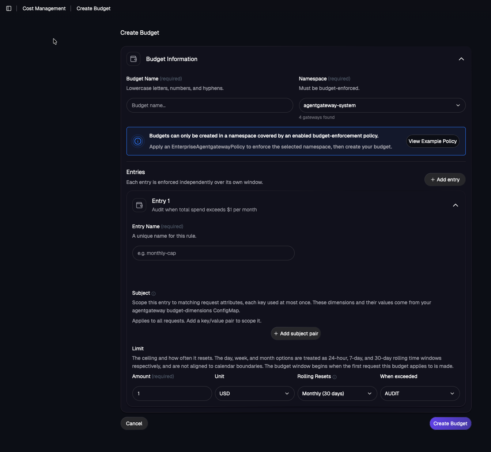

## Deployment

1. Set a license key
```
export AGENTGATEWAY_LICENSE_KEY=<agentgateway-license-key>
```

2. Install the k8s gateway api CRDs
```
kubectl apply -f https://github.com/kubernetes-sigs/gateway-api/releases/download/v1.5.0/standard-install.yaml
```

3. Use `v2026.6.3` and above
```
helm upgrade -i --create-namespace \
  --namespace agentgateway-system \
  --version v2026.6.3 enterprise-agentgateway-crds oci://us-docker.pkg.dev/solo-public/enterprise-agentgateway/charts/enterprise-agentgateway-crds \
  --create-namespace
```

4. Deploy the chart
```
helm upgrade -i -n agentgateway-system enterprise-agentgateway oci://us-docker.pkg.dev/solo-public/enterprise-agentgateway/charts/enterprise-agentgateway \
--version v2026.6.3  \
--set-string licensing.licenseKey=${AGENTGATEWAY_LICENSE_KEY}
```

### Management UI

```
helm upgrade -i management oci://us-docker.pkg.dev/solo-public/solo-enterprise-helm/charts/management \
  --namespace agentgateway-system \
  --create-namespace \
  --version 0.4.8 \
  --set cluster="mgmt-cluster" \
  --set products.agentgateway.enabled=true \
  --set-string licensing.licenseKey=${AGENTGATEWAY_LICENSE_KEY} \
  --set products.agentgateway.features.cost-management=true
```

## Seeing The Dashboard

The dashboard shows you spend over time and by provider/model along with users, groups, and virtual keys.




You can change the dashboard to show specific information that you'd like to see (Models, Providers, etc.)



Within the Cost Catalog, you can see how much you've spent dollar-wise based on provider, model, and date.



Budgets can be set (e.g - 100 dollars for X about of requests)



## Observability

There are GenAI cost/token metrics emitted by agentgateway:

- agentgateway_gen_ai_client_cost_usd_total
- agentgateway_gen_ai_client_token_usage_sum
- agentgateway_cost_catalog_lookups_total

You can see these via, for example, Prometheus.

**Sidenote**: The agw management UI uses ClickHouse-backed telemetry; Prometheus/Grafana uses agentgateway-emitted metrics.

## Budget CRD

```
apiVersion: enterpriseagentgateway.solo.io/v1alpha1
kind: EnterpriseAgentgatewayBudget
```

It supports:
- budget units: Tokens, USD
- windows: Day, Week, Month, Year
- actions: Audit, Block
- subject dimensions like virtualKey, model, provider, custom dimension

Policy Wiring: Budgets are enforced through `EnterpriseAgentgatewayPolicy.spec.traffic.entBudgetEnforcement`

Here are three examples with the budget CRD:

```
apiVersion: enterpriseagentgateway.solo.io/v1alpha1
kind: EnterpriseAgentgatewayBudget
metadata:
  name: daily-token-budget-by-virtual-key
  namespace: team-alpha
spec:
  budgets:
    - name: alpha-demo-daily-tokens
      subject:
        virtualKey: alpha-demo
      limit:
        unit: Tokens
        amount: 100000
      window:
        unit: Day
      onBudgetExceeded: Block
```

```
apiVersion: enterpriseagentgateway.solo.io/v1alpha1
kind: EnterpriseAgentgatewayBudget
metadata:
  name: monthly-usd-budget-for-gemini
  namespace: team-alpha
spec:
  budgets:
    - name: gemini-monthly-usd
      subject:
        provider: gcp.gemini
        model: gemini-2.5-flash
      limit:
        unit: USD
        amount: 50
      window:
        unit: Month
      onBudgetExceeded: Audit
```

```
apiVersion: enterpriseagentgateway.solo.io/v1alpha1
kind: EnterpriseAgentgatewayBudget
metadata:
  name: team-provider-weekly-budget
  namespace: team-alpha
spec:
  budgets:
    - name: platform-team-anthropic-weekly
      subject:
        group: platform-team
        provider: anthropic
      limit:
        unit: USD
        amount: 100
      window:
        unit: Week
      onBudgetExceeded: Block
    - name: any-virtual-key-weekly-token-audit
      subject:
        virtualKey: "*"
      limit:
        unit: Tokens
        amount: 500000
      window:
        unit: Week
      onBudgetExceeded: Audit
```

To ensure an `EnterpriseAgentgatewayBudget` is used, it must be enabled via a Policy.

This enables budget enforcement for the targeted HTTPRoute. Swap namespace and targetRefs[0].name to match the route you want the budgets applied to:

```
apiVersion: enterpriseagentgateway.solo.io/v1alpha1
kind: EnterpriseAgentgatewayPolicy
metadata:
  name: enable-budget-enforcement
  namespace: team-alpha
spec:
  targetRefs:
    - group: gateway.networking.k8s.io
      kind: HTTPRoute
      name: my-llm-route
  traffic:
    entBudgetEnforcement: {}
```

If your budgets live in a different namespace, use discovery:

```
apiVersion: enterpriseagentgateway.solo.io/v1alpha1
kind: EnterpriseAgentgatewayPolicy
metadata:
  name: enable-budget-enforcement
  namespace: team-alpha
spec:
  targetRefs:
    - group: gateway.networking.k8s.io
      kind: HTTPRoute
      name: my-llm-route
  traffic:
    entBudgetEnforcement:
      discovery:
        namespaces:
          from: All
```