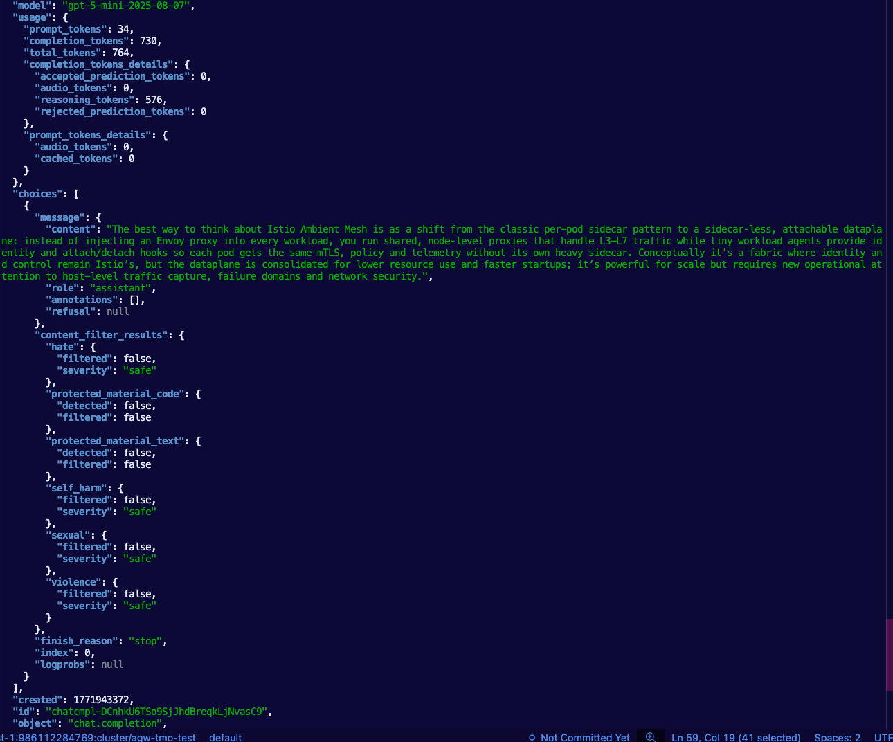

```
export AZURE_FOUNDRY_API_KEY=
```

```
kubectl apply -f- <<EOF
kind: Gateway
apiVersion: gateway.networking.k8s.io/v1
metadata:
  name: agentgateway-azureopenai-route
  namespace: agentgateway-system
  labels:
    app: agentgateway-azureopenai-route
spec:
  gatewayClassName: enterprise-agentgateway
  listeners:
  - protocol: HTTP
    port: 8081
    name: http
    allowedRoutes:
      namespaces:
        from: All
EOF
```

```
export INGRESS_GW_ADDRESS=$(kubectl get svc -n agentgateway-system agentgateway-azureopenai-route -o jsonpath="{.status.loadBalancer.ingress[0]['hostname','ip']}")
echo $INGRESS_GW_ADDRESS
```

```
kubectl apply -f- <<EOF
apiVersion: v1
kind: Secret
metadata:
  name: azureopenai-secret
  namespace: agentgateway-system
  labels:
    app: agentgateway-azureopenai-route
type: Opaque
stringData:
  Authorization: $AZURE_FOUNDRY_API_KEY
EOF
```

```
kubectl apply -f- <<EOF
apiVersion: agentgateway.dev/v1alpha1
kind: AgentgatewayBackend
metadata:
  labels:
    app: agentgateway-azureopenai-route
  name: azureopenai
  namespace: agentgateway-system
spec:
  ai:
    provider:
      azureopenai:
        endpoint: mlevantesting-resource.services.ai.azure.com
        deploymentName: gpt-5-mini
        apiVersion: 2025-01-01-preview
  policies:
    auth:
      secretRef:
        name: azureopenai-secret
EOF
```

```
kubectl get agentgatewaybackend -n agentgateway-system
```

```
kubectl apply -f- <<EOF
apiVersion: gateway.networking.k8s.io/v1
kind: HTTPRoute
metadata:
  name: azureopenai
  namespace: agentgateway-system
  labels:
    app: agentgateway-azureopenai-route
spec:
  parentRefs:
    - name: agentgateway-azureopenai-route
      namespace: agentgateway-system
  rules:
  - matches:
    - path:
        type: PathPrefix
        value: /azureopenai
    filters:
    - type: URLRewrite
      urlRewrite:
        path:
          type: ReplaceFullPath
          replaceFullPath: /v1/chat/completions
    backendRefs:
    - name: azureopenai
      namespace: agentgateway-system
      group: agentgateway.dev
      kind: AgentgatewayBackend
EOF
```

```
curl "$INGRESS_GW_ADDRESS:8081/azureopenai" -v -H content-type:application/json -d '{
  "messages": [
    {
      "role": "system",
      "content": "You are a skilled cloud-native network engineer."
    },
    {
      "role": "user",
      "content": "Write me a paragraph containing the best way to think about Istio Ambient Mesh"
    }
  ]
}' | jq
```

